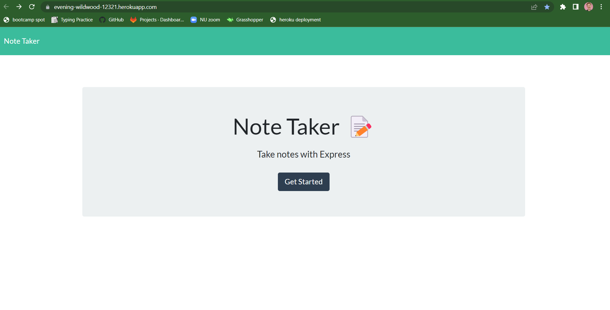

  

  # Express.js Note Taker App - Challenge 11

  ## Description: 
  The goal of this project was to build an application that could be used to write and save notes. We were to use an Express.js back end and save and retrieve note data from a JSON file. In the coming weeks, I intend to come back to this project to add the delete function.

  [LIVE LINK](https://evening-wildwood-12321.herokuapp.com/)

  
  
  
  

  ## Table of Contents:
  - [Description](#description)
  - [Usage](#usage)
  - [Contributions](#contributions)
  - [Questions](#questions)
  - [License](#license)

  ## Usage
  Launch the app from its heroku address (https://evening-wildwood-12321.herokuapp.com/) or at the LIVE LINK above. Then simply enter the notes page and save your note from there.

  ## Contributions
  I collaborated on the logic and various bug fixes with classmates Leah Roman, Jared Johnson, Joseph Ruiz, and Jordan Harris. 

  ## Questions
  Feel free to check out my GitHub page at: 
   https://github.com/tyleresselman

  And you can contact me directly via email at the following address: 
   [tme91302@gmail.com](mailto:tme91302@gmail.com)

  ## License
  I used The MIT License as the license for this project. Please follow this link if you want to learn more: https://opensource.org/licenses/MIT
